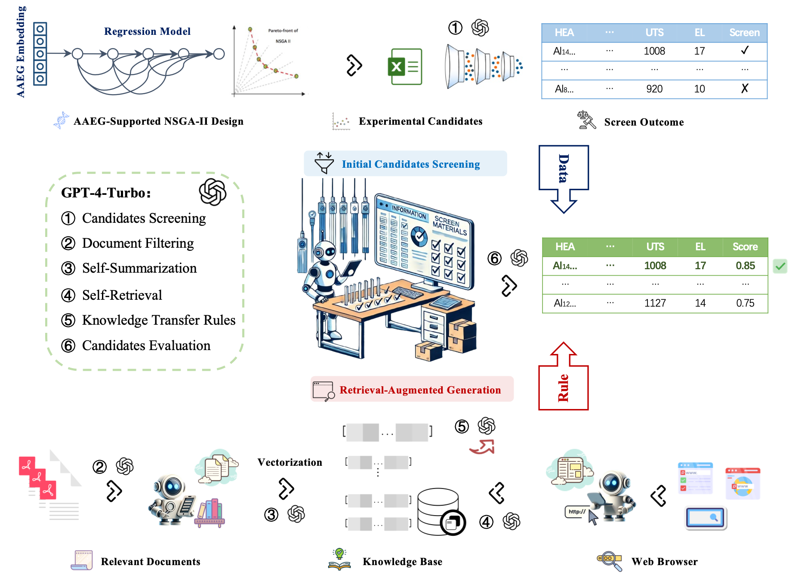
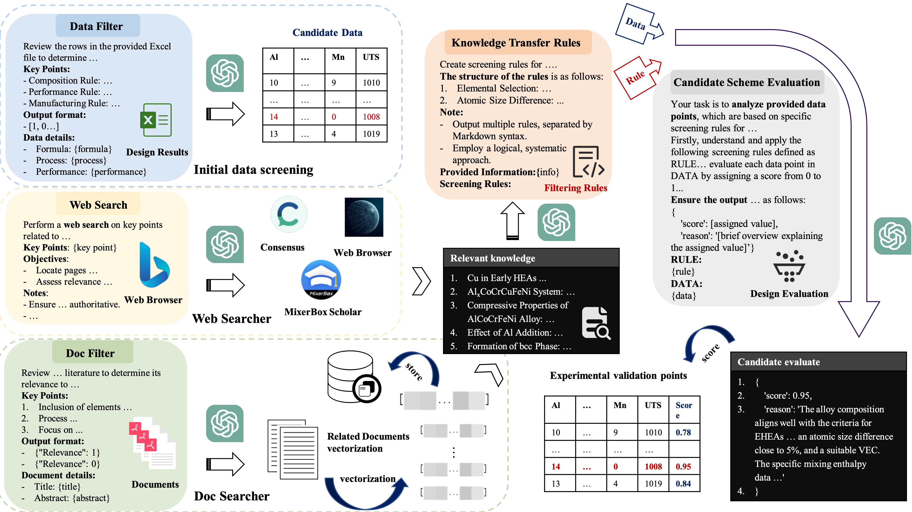

# Automated Material Screening and Evaluation Pipeline (AMSEP))

***Paper title: From Small Data Modeling to Large Language Model Screening: A Dual-Strategy Framework for Materials Intelligent Design***
***Part: Using GPT4 to screen pre-designed material components***



1. **Preliminary Literature and Data Screening**: Begin by filtering relevant literature and data points according to the task description. The literature selection process involves only the title and abstract for initial screening. Data screening primarily relies on a systematic approach, using the composition system to guide selection.

2. **Key Search Point Inquiry**: Employ specific strategies to search for related knowledge:
   - Literature Vectorization Search: Perform searches using vectorized representations of literature, selecting the top K (K=5) results.
   - Web Search: Utilize GPT-4's integrated Bing search for each Key Search Point to compile a knowledge summary.

1. **Knowledge Synthesis**: Based on the knowledge acquired in step 2, utilize GPT-4 to synthesize rules for selecting components.

2. **Scoring and Experimental Validation**: Apply the synthesized knowledge to score 362 design outcomes individually. Proceed to experimentally validate the design with the highest score.



### Data Initial Screening

``` python
Data Filter Prompt:
"""Review the rows in the provided Excel file to determine if they meet the requirements of key aspects of eutectic high entropy alloy design. Each row must be assessed to ensure it conforms to the specified key points. The entries should satisfy the following key points:

Key Points:
1. Composition Rule: Select alloys containing Al, Co, Cr, Fe, and Ni. Optionally include Mu and Cu. The possibility of forming eutectic high-entropy alloys in other systems should be evaluated.
2. Performance Rule: Choose alloys with Ultimate Tensile Strength (UTS) over 1000 MPa and Elongation (EL) above 15%. Additionally, considering the reliability of data, higher performance is always better.
3. Manufacturing Rule: Prefer alloys that require minimal heat treatment and cold rolling, in line with green manufacturing principles.

Please review each row listed below and output a list indicating whether each row meets these requirements, denoted as 1 (meets requirements) or 0 (does not meet requirements).

Output format:
- List of whether each row meets the requirements: [Meets Requirements for Row 1, Meets Requirements for Row 2, ...], 
Example:
If the first row meets the requirements and the second does not, the output should be [1, 0].

Data details:
{data}
"""
```
- **Initial Input of Design Data**: Start with 1,031 entries of design data, initially screened based on whether the performance of UTS (Ultimate Tensile Strength) and EL (Elongation) meets the criteria. Subsequently, through smart manufacturing and common EHEA (Entropy High Entropy Alloys) systems, and after GPT filtering, 362 data entries are obtained (selecting 10 entries at a time, for a total of 104 filtering rounds).
- **Model Utilization**: Employ the "gpt-4-0125-preview" model for analysis and filtering tasks.

### Paper Filter Prompt

``` python
Paper Filter Prompt:
"""Review the provided literature to determine its relevance to key aspects of eutectic high entropy alloy design. Add it to the knowledge base for inverse design rules if relevant. The literature should partially or fully relate to these key points:

Key Points:
1. Inclusion of elements Al, Co, Cr, Fe, Ni (mandatory) and Mu, Cu (optional) in the eutectic high entropy alloy.
2. Process features like cold rolling, heat treatment temperature, and time.
3. Focus on high UTS (Ultimate Tensile Strength) and EL (Elongation) in eutectic high entropy alloy design.

Output format:
- {"Relevance": 1} (for high relevance, suitable for the knowledge base)
- {"Relevance": 0} (for low relevance, unsuitable for the knowledge base)

Document details:
- Title: {title}
- Abstract: {abstract}

Please output either {"Relevance": 1} or {"Relevance": 0}, without providing reasons or restating the information from the document I provided.
"""
```

### Key Search Point for Search (Web and Doc)

```
- "Eutectic high entropy alloys composition including Al, Co, Cr, Fe, Ni with optional elements Mu, Cu" 

- "Incorporating too many elements in a high entropy alloy affect the casting process, particularly in terms of remelting and elemental segregation" 

- "The specific issues and complications that arise from including Mn in alloy compositions during the casting process" 

- "Effects of cold rolling, heat treatment temperature and time on eutectic high entropy alloys" 

- "The necessity of heat treatment in alloy production, its impact on production costs, and how avoiding it aligns with green manufacturing principles" 

- "Characteristics of eutectic high entropy alloys with high UTS and EL" 

- "The formation of solid solutions governed by the Hume-Rothery rules"

```
### Web Search Prompt

``` python
Web Search Prompt:
"""Perform a web search on key points related to eutectic high entropy alloy inverse design rules for inclusion in a targeted knowledge base.

Key Points: {key_point}

Objectives:
- Locate pages with detailed information or studies on these points.
- Assess relevance for the knowledge base.

Notes:
- Use specific keywords for relevance to high entropy alloy design.
- Ensure sources are reliable and authoritative.
- Summarize key findings."""
```

### Knowledge to Rules Prompt

``` python
Knowledge Transfer Prompt:
"""
Create screening rules for high-entropy alloy compositions to identify candidates for experimental validation, based on the provided information.

The structure of the rules is as follows:
Elemental Selection: Focus on elements like Al, Co, Cr, Fe, Ni, known for forming stable high-entropy mixtures.
Atomic Size Difference: Aim for a moderate size difference (about 5%) among elements to enhance stability and solid solution formation.

Note:
- Output multiple rules, separated by Markdown syntax.
- Employ a logical, systematic approach.

Provided Information:
{info}

Screening Rules:
"""
```

### RULEs
``` 
- Elemental Selection: Choose elements that form a single-phase solid solution or a simple eutectic system. The elements Al, Co, Cr, Fe, Ni are commonly used in EHEAs due to their compatibility and ability to form stable high-entropy mixtures. 

- Optional Elements Effect: Cu enhances corrosion resistance and conductivity but may lower thermal stability. Mn alters fluidity and solidification, risking casting defects and phase instability, leading to unwanted phases or microstructures.

- Atomic Size Difference: The atomic radii of the constituent elements should differ by a margin of 5% to 15%, a range that assists in maintaining a stable solid solution while simultaneously minimizing lattice distortion.

- Valence Electron Concentration (VEC): The VEC should be in a range that favors the formation of desired phases (like FCC, BCC, or HCP). The phase stability in high entropy alloys is often influenced by the electron concentration. 

- Mixing Enthalpy: Select elements with negative or low positive mixing enthalpies to promote solid solution formation and reduce the tendency for intermetallic compound formation.

- Advancing Green Manufacturing: To maintain the intrinsic strength and castability of eutectic high entropy alloys with minimal heat treatment and post-processing, adherence to green manufacturing principles is essential, streamlining the production process.

- Phase Diagram Analysis: Identify eutectic points where a simple solid solution or a combination of phases (like FCC+B2) can form. Look for compositions that avoid brittle intermetallic phases. Select compositions near eutectic points that favor the formation of desired solid solution phases. 

- Weighted Average Physical Properties: Consider the weighted average of physical properties like melting point, density, and elasticity of the constituent elements.
```
### Candidata Screening Prompt

``` python
Candidata Screening Prompt: 
"""You will act as an expert in materials science, specializing in high entropy alloys (HEAs). Your task is to analyze provided data points, which are based on specific screening rules for HEA components.

Firstly, understand and apply the following screening rules defined as RULE. These rules are crucial for evaluating the potential of each HEA component.

Secondly, evaluate each data point in DATA by assigning a score from 0 to 1, indicating its suitability for experimental validation in high-entropy alloys (HEAs). A score of 1 signifies high relevance. Include a short explanation for each score, focusing on pertinent scientific concepts and considering the complexities and potential results of the experimental process in HEAs.

RULE:
{rule}

DATA:
{data}

Ensure the output for each evaluated data point is formatted as follows, data calculations can be analyzed if necessary. Give me the output directly in the following format without any other information:
{
    'score': [assigned value],
    'reason': '[brief overview explaining the assigned value]'
}"""
```